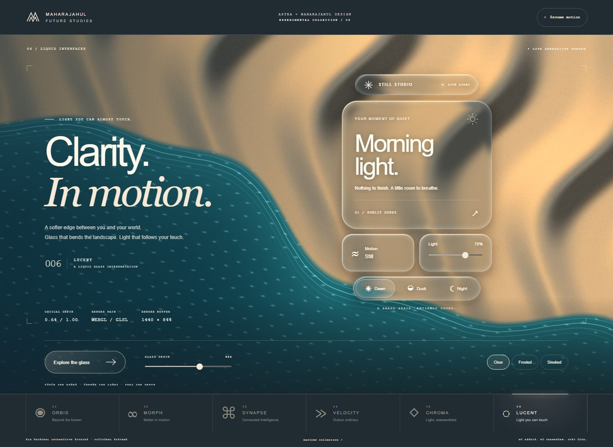
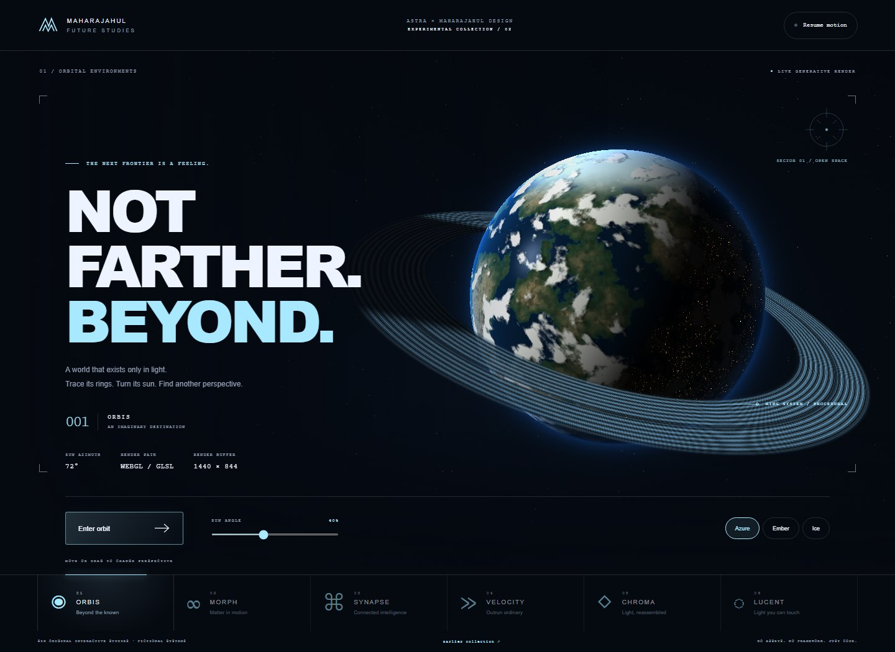
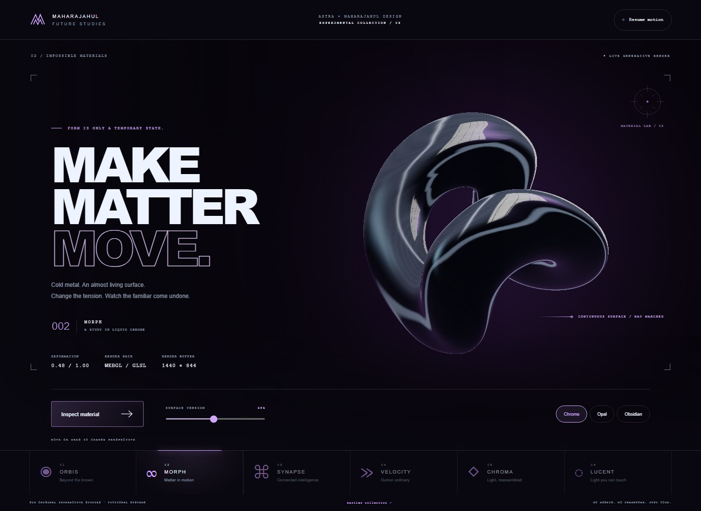
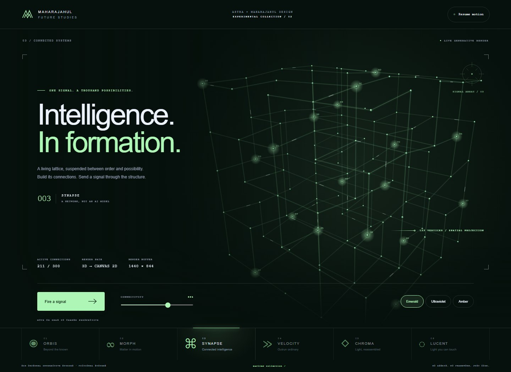
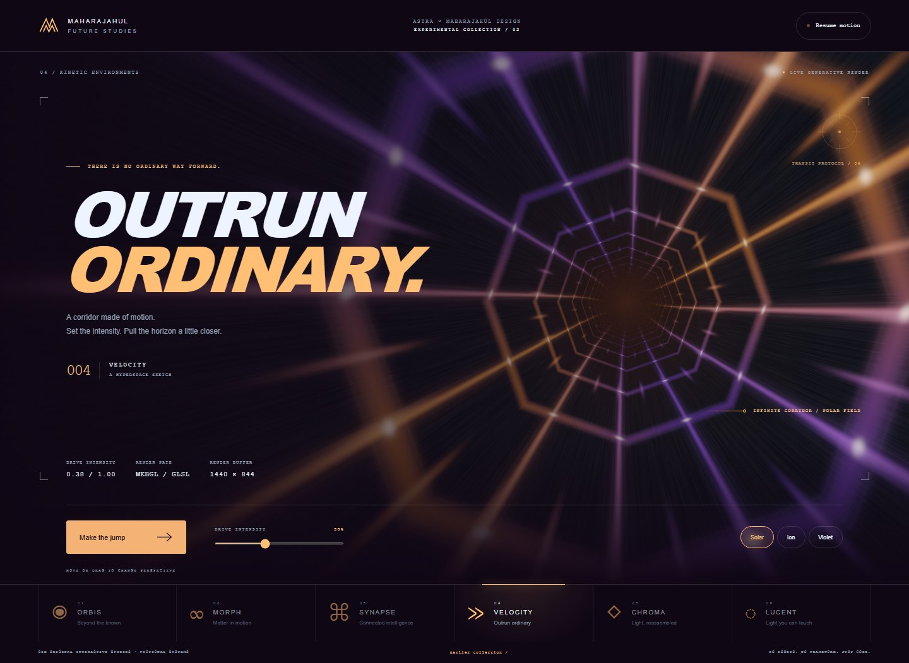
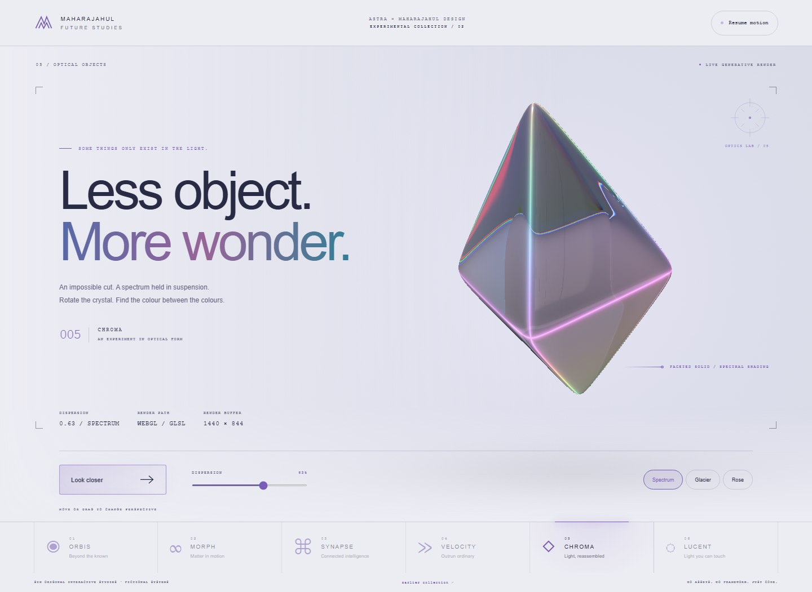

<p align="center"></p>

<h1 align="center">Maharajahul Design</h1>

<p align="center">From a brief to an interface worth experiencing.</p>

<p align="center">
  <a href="https://maharajahu.github.io/maharajahul-design/"></a>
  <a href="SKILL.md"></a>
  <a href="https://github.com/Maharajahu/maharajahul-design/actions/workflows/checks.yml"></a>
</p>

<p align="center">
  <a href="https://maharajahu.github.io/maharajahul-design/">Showcase</a> ·
  <a href="#install">Install</a> ·
  <a href="#what-the-skill-does">Capabilities</a> ·
  <a href="#try-a-brief">Example prompts</a> ·
  <a href="#develop-and-verify">Development</a>
</p>

<a href="https://maharajahu.github.io/maharajahul-design/samples/future/#lucent"></a>

**A portable design skill for coding agents.** Maharajahul Design connects art direction, working interactions and visual inspection. It helps an agent make deliberate choices about hierarchy, materials, motion and implementation instead of treating styling as the last step.

This repository contains the skill, focused implementation guides, an original decision catalogue, **8 coordinated design directions**, **11 source-backed recipes**, two optional tools, and **11 interactive demos**. The demos run with local HTML, CSS and JavaScript: no framework, build step, API key or runtime package installation.

## Explore the work

These are actual browser renders, not mockups. Select an image to open its live scene.

<table>
  <tr><th width="50%">ORBIS — orbital environments</th><th width="50%">MORPH — impossible materials</th></tr>
  <tr>
    <td><a href="https://maharajahu.github.io/maharajahul-design/samples/future/#orbis"></a><br>Turn the sun, change the atmosphere and enter orbit.</td>
    <td><a href="https://maharajahu.github.io/maharajahul-design/samples/future/#morph"></a><br>Ray-marched metal, studio reflections and adjustable surface tension.</td>
  </tr>
  <tr><th>SYNAPSE — connected systems</th><th>VELOCITY — kinetic environments</th></tr>
  <tr>
    <td><a href="https://maharajahu.github.io/maharajahul-design/samples/future/#synapse"></a><br>125 spatial nodes. Adjust connectivity and send a signal.</td>
    <td><a href="https://maharajahu.github.io/maharajahul-design/samples/future/#velocity"></a><br>Layered tunnel panels, light rails and an interactive drive control.</td>
  </tr>
  <tr><th>CHROMA — optical objects</th><th>LUCENT — liquid interfaces</th></tr>
  <tr>
    <td><a href="https://maharajahu.github.io/maharajahul-design/samples/future/#chroma"></a><br>Refraction, spectral separation and thickness-dependent absorption.</td>
    <td><a href="https://maharajahu.github.io/maharajahul-design/samples/future/#lucent"></a><br>Screen-space lensing, three glass finishes and changing daylight.</td>
  </tr>
</table>

**[Earlier collection →](https://maharajahu.github.io/maharajahul-design/samples/)** Five additional interface studies: Off Hours, Pulse, Form, Cutroom and Drift. Editorial composition, dashboard controls, product configuration, a vector-scene editor and a procedural landscape.

All demo products and data are illustrative. Future Studies are stylized real-time experiments, not physically accurate simulations. Lucent is an original web interpretation inspired by [Apple's Liquid Glass material](https://developer.apple.com/videos/play/wwdc2025/219/), not an Apple component or native iOS implementation.

## What the skill does

| Area | Direction it provides |
| --- | --- |
| Visual identity | Establish hierarchy, typography, color and a composition that belongs to the subject. |
| Interaction | Connect controls to real state; cover navigation, feedback, recovery and reduced motion. |
| Web and native UI | Work within the existing stack, state ownership, input model and lifecycle. |
| Real-time graphics | Connect geometry, lighting, materials and camera choices to a visible result. |
| Visual assets | Plan useful images, textures and media, then inspect them in their actual placement. |
| Design handoff | Preserve intent and implementation constraints across design files and code. |
| Verification | Distinguish a successful build, a working interaction and a visually convincing result. |

## Build from a recipe

The [recipe library](references/recipes.md) explains the mechanisms behind every demo: construction order, working source, numerical starting points, interaction state, limitations and verification. Load the relevant recipe, not the entire collection.

- **Materials and scenes:** [Liquid glass](references/recipes/liquid-glass.md), [orbital planet](references/recipes/orbital-planet.md), [liquid metal](references/recipes/liquid-metal.md), [spectral crystal](references/recipes/spectral-crystal.md), [spatial network](references/recipes/spatial-network.md), [kinetic tunnel](references/recipes/kinetic-tunnel.md), [contour landscape](references/recipes/contour-landscape.md).
- **Working interfaces:** [Editorial spread](references/recipes/editorial-spread.md), [energy dashboard](references/recipes/energy-dashboard.md), [product configurator](references/recipes/product-configurator.md), [timeline workspace](references/recipes/timeline-workspace.md).
- **Beyond the demos:** [Design systems, typography and charts](references/design-directions.md), [motion recipes](references/motion-recipes.md), [GPU pipelines and audio](references/gpu-pipelines.md), [web frameworks](references/web-patterns.md), [native UI](references/native-patterns.md), [desktop and JavaFX](references/desktop-patterns.md).

Search across **16 domains** and implementation notes for **22 stacks**. A design-system proposal combines palette roles, font stacks, spacing, shape, layout and motion; it is an adaptable starting point, not an automatic design-quality guarantee. The eight authored directions are a compact library, not an exhaustive product database or a bundled font/icon collection.

The skill is guidance for the agent you already use, not a model, rendering engine or automatic quality guarantee. Available tools and the agent's capabilities still determine what can be built and verified.

## Install

Clone or [download the repository](https://github.com/Maharajahu/maharajahul-design/archive/refs/heads/main.zip):

```sh
git clone https://github.com/Maharajahu/maharajahul-design.git
```

Copy the **whole `maharajahul-design` folder** into the skills location your agent supports:

| Scope | Destination |
| --- | --- |
| Codex, your user account | `~/.codex/skills/maharajahul-design/` |
| Project-local shared skills | `.agents/skills/maharajahul-design/` |
| Another agent environment | Its supported skill directory, or load `SKILL.md` and the referenced files directly. |

Keep `SKILL.md`, `references/`, `data/` and `scripts/` together. Use one installation location per agent; update an existing copy instead of creating duplicates. Reload or restart the agent if the new skill is not discovered.

Invoke it by name:

```text
Use $maharajahul-design to turn this brief into a working interface.
Establish a clear visual direction, implement the actual interactions,
and inspect the result at desktop and phone sizes.
```

No script installation is required to read and use the skill. The demos also open directly from `samples/future/index.html` or `samples/index.html`.

## Try a brief

**Build something distinctive**

> Use $maharajahul-design to build a cinematic material showcase. Make lighting reveal the object, keep the controls useful, and verify the actual rendering on desktop and phone-sized viewports.

**Improve an existing product**

> Use $maharajahul-design to improve this booking screen. Keep the existing components. Make availability, price and the next action clear, including the state where no appointments are available.

**Review without changing anything**

> Use $maharajahul-design to review this interface. Explain the three most consequential issues with visible evidence. Do not edit files.

## Optional tools

The [decision lookup](scripts/lookup.py) uses Python 3.10+ and the standard library. It runs offline and explains literal keyword matches; scores are not quality ratings or model confidence.

```sh
python scripts/lookup.py "pricing comparison evidence" --surface campaign
python scripts/lookup.py "water shoreline foam" --surface immersive --stack threejs
python scripts/lookup.py --stack swiftui --json
python scripts/lookup.py "liquid glass refraction" --surface application
python scripts/lookup.py "operations queue dashboard" --design-system --stack react
python scripts/lookup.py "editorial journal paper" --domain typography --design-system
python scripts/lookup.py --list-domains
```

The [capture helper](scripts/capture.mjs) uses Node.js 20+ and an **existing** Playwright project with Chromium installed. It does not install dependencies or browsers.

```sh
node scripts/capture.mjs --url http://127.0.0.1:3000 --project /path/to/app --out /path/to/captures
```

It saves fresh screenshots and a report of observable browser problems. Inspect the screenshots: a clean report does not certify design quality or accessibility.

## Develop and verify

```sh
python -B -m unittest discover -s tests -p "test_*.py"
node --test tests/capture.test.mjs tests/samples.test.mjs tests/future.test.mjs tests/site.test.mjs tests/recipes.test.mjs
```

Browser integration tests run when `MAHARAJAHUL_BROWSER_PROJECT` points to an existing Playwright project. Otherwise those tests explicitly skip; unit and publication checks still run. CI runs the dependency-free checks, not a GPU benchmark.

Recipe tests execute the documented mathematical/state cores. Catalogue tests check retrieval, local links, coverage, proposal boundaries and opaque palette text contrast. They do not certify shader portability, transparency contrast or native-platform behavior without rendering on the relevant target.

The Future Studies suite checks six scenes at desktop and phone sizes, non-empty rendering, actual pixel changes from controls, navigation, inspection mode and reduced-motion behavior. Phone-sized Chromium checks are not a substitute for testing physical iOS and Android devices. GPU performance and browser support vary; Synapse uses Canvas 2D when WebGL is unavailable.

## Source and attribution

Built by [Maharajahu](https://github.com/Maharajahu) with AI-assisted development. The repository contains newly written guidance and code, not a bundled third-party skill, font pack, icon library or external design dataset. Screenshots show this repository's own demos. Product and framework names identify workflows or inspiration, not endorsements.

No public redistribution license has been selected. Public visibility alone does not grant permission to reuse or redistribute this work.

[Report an issue](https://github.com/Maharajahu/maharajahul-design/issues) · [Read the skill](SKILL.md) · [Explore the demos](https://maharajahu.github.io/maharajahul-design/)
